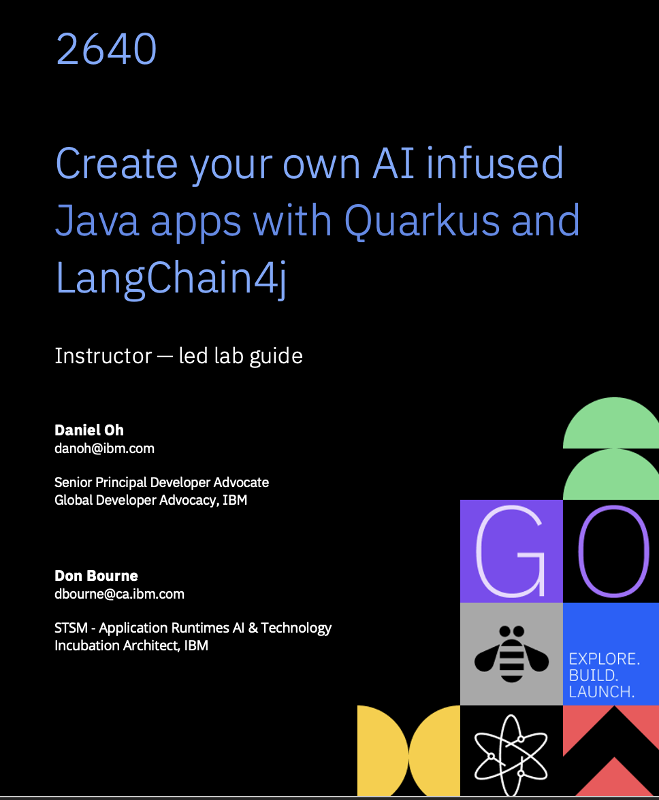

# Lab 2640: Create your own AI infused Java apps with Quarkus and LangChain4j

**Tuesday, Oct 7th | 04:15 pm - 05:45 pm EDT**

Generative AI has gained significant attention over the past year, and many executive leaders are pushing Java developers to integrate AI into their applications. 
Does this mean we have to abandon what we've built and become data scientists? Not at all. 
Thanks to new projects that simplify the process, we can incorporate AI models developed by experts into our applications without major disruptions. 
Quarkus provides an excellent developer experience, and LangChain4j offers strong AI integration capabilities, so getting started with AI is more straightforward than it might seem. 
This hands-on lab will cover a range of AI features. We’ll begin with the Quarkus DevUI, where you can experiment with AI models before writing any code. 
Then, we’ll dive into coding and explore LangChain4j capabilities, including prompting, chaining, state management, agents, function calling, and retrieval-augmented generation (RAG) for integrating external knowledge. 
We’ll also examine how to run and train models locally using tools like Ollama and Podman AI Lab. Additionally, we’ll discuss observability, fault tolerance, and compiling AI-integrated applications into native binaries. 
Time permitting, we might even try generating images or audio. This lab is an opportunity to learn how to build AI-enhanced Java applications directly from Quarkus experts and engineers working on LangChain4j extensions. 
Attendees can also share feedback with the maintainers of these projects and engage with the community.

**Lab Instructors**

* Daniel Oh - Java Champion & Senior Principal Developer Advocate / Red Hat & IBM
* Don Bourne - STSM / Application Runtimes AI & Technology Incubation Architect, IBM

The workshop is divided into several steps. You can follow the instructions available in the [workshop website](https://danieloh30.github.io/quarkus-workshop-langchain4j/docs/docs).
Alternatively, you may serve the instructions locally by following the [docs/README file](docs/README.md).

# Lab 2641: Think Agentic AI is only for Python? Think again. Java’s in the game

**Wednesday, Oct 8th | 02:00 pm - 03:30 pm EDT**

Are you ready to revolutionize your Java application with the latest AI trend? Let's dive into the world of AI Agents and discover how they can unleash new capabilities! 
We'll start by showing you how to create and deploy AI Agents in a snap, and put them to work on various tasks. 
But that's not all - we'll also give them the tools and resources they need to make autonomous decisions and deliver quality results. 
But, beware: a single agent can quickly become a bloated superhero with too many responsibilities, leading to slower performance, higher costs, and mediocre results. 
To avoid this, we'll introduce you to the power of multiple, specialized agents that can team up and work together in harmony using Agentic workflow patterns. 
By the end of this journey, you'll have created a cutting-edge, enterprise-ready Java application that's powered by versatile AI Agents. 
Are you ready to unleash their potential?

**Lab Instructors**

* Don Bourne - STSM / Application Runtimes AI & Technology Incubation Architect, IBM
* Alasdair Nottingham - WebSphere Chief Architect, IBM
* Daniel Oh - Java Champion & Senior Principal Developer Advocate / Red Hat & IBM

The workshop is divided into several steps. You can follow the instructions available in the [workshop website](https://danieloh30.github.io/quarkus-workshop-langchain4j/docs/docs). 
Alternatively, you may serve the instructions locally by following the [docs/README file](docs/README.md).
